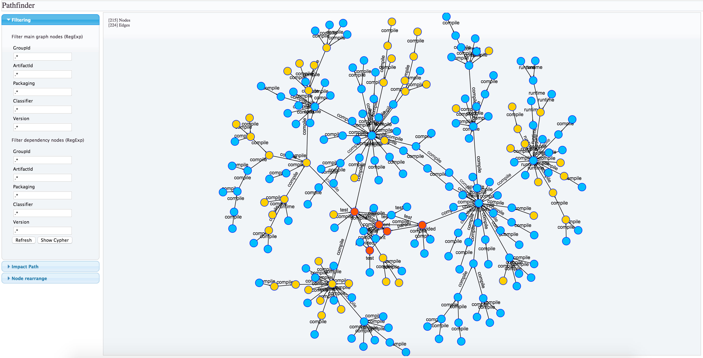

# Pathfinder

**Author** : [Michele Sacchetti]

**Version** : 0.1.0-SNAPSHOT (Yes, still work in progress!)

**License** : <http://www.apache.org/licenses/LICENSE-2.0>

## Intro

Every software projects starts its life with few lines of code, but as time passes, things grows up, classes becomes modules, then submodules, then external dependencies.

More developers are added to the team, dependencies list grows huge and you start suffering backward compatibility pains for your production code.

You start posing question like:

- "If I modify this module, how many other teams/projects/modules are using it? They must inherit the modified code as wall, but how can I get a full list?"

- "I have to estimate time spent to modify this module, but how many other module depends on it? I have to modify them as well before performing a release"

## What is Pathfinder?

Pathfinder is a developer / release manager assistant which will help you:

  - Trace all you projects dependencies and cross-dependencies
  
  - Identify SNAPSHOT or branch-based dependencies at a glance
  
  - Create a "release path" to optimize your delivery time
  
  - Know every project your current code is actually included
  
  - ( Many other in the future..)
  
## How Pathfinder works

Pathfinder analyzes your projects dependencies and store them as a relational graph.

Dependencies coming from different project are merged together to from a unique relation ecosystem to be analyzed.

Patterns are then extracted to retrieve only information relevant to the project you are working on and its impact on other projects into the graph.

# Getting started

To start using pathfinder:

- Checkout git repository

- Learn how to start [pathfinder-server]

- Integrate [pathfinder-maven-plugin] into your build chain to start collecting data

- Deploy [pathfinder-web] over a path accessible by your favorite web browser (Apache or even local path will fit)

- Read [Pathfinder User Guide] to start analyzing your projects

[//]: # (These are reference links used in the body of this note and get stripped out when the markdown processor does its job. There is no need to format nicely because it shouldn't be seen. Thanks SO - http://stackoverflow.com/questions/4823468/store-comments-in-markdown-syntax)

   [Maven Dependency Plugin]: <https://maven.apache.org/plugins/maven-dependency-plugin/>
   [Michele Sacchetti]: <http://aroundthecode.org>
   [pathfinder-server]: <./pathfinder-server>
   [pathfinder-maven-plugin]: <./pathfinder-maven-plugin>
   [pathfinder-web]: <./pathfinder-web>
   [Pathfinder User Guide]: <./docs>

