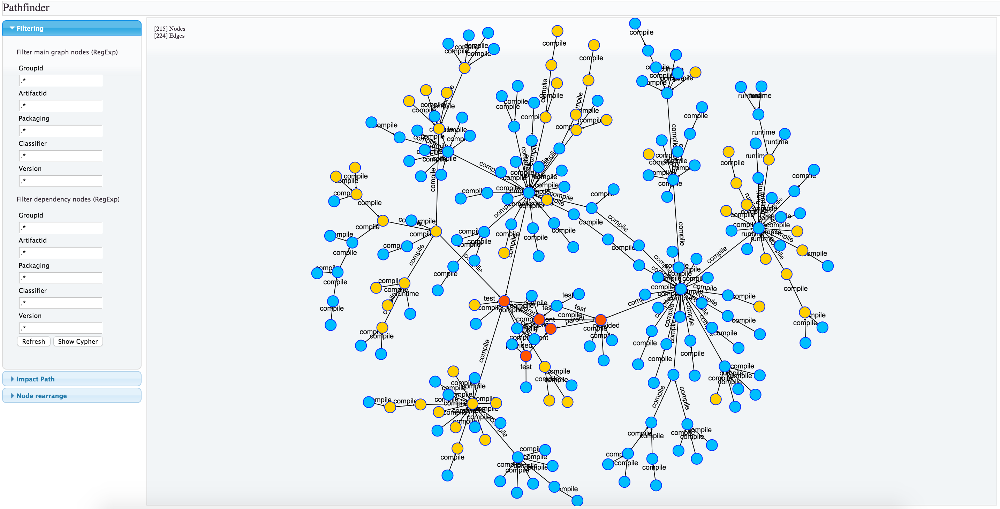

# Pathfinder User Guide

## Main Screen

As soon as you open pathfinder interface you will be presented with a global overview of your dependency graph

This is a sample of the full dependencies graph of Pathfinder project itself

## Project filtering

The first step you will probably want to perform is to filter such graph over the artifacts properties you want to analyze.

Do do so you can use the first filtering group which will filter over main dependencies properties.
With this kind of filtering you will obtain a filter over inner nodes, leaving external dependencies on leaves:
  

The second filtering group will act also on leaf nodes, allowing you to obtain a graph just of your internal packages

## Identify Snapshots and branches.

These (un)filtered graph can actually provide you with many useful information with the first glance since node coloring will help you identify:

- SNAPSHOT dependencies : marked in RED, are identified by any version string containing "SNAPSHOT" string

- BRANCH dependencies : marked in YELLOW, are identified by any version string containing characters other then the regular expression  [0-9]\*(\.[0-9]\*)\* (some whitelist is needed in future release to handle common "RELEASE" or "Final" tokens)

- RELEASE dependencies : marked in blue, are regular stable release artifact

## Impact Path

Impact Path section will help you identify all dependencies involved when you are modifying a release artifact.

When you are working on very complex projects, just modifying one library may have several impact on other project which include it as a dependency.

Setting the search parameters on the library you are working on, you can easily get a graph of all libraries which include it. 

The **Search Depth** parameter will tell how many dependency-of-dependency hop have to be included into the graph.

**Note:** When you are working on a SNAPSHOT project, which has not been analyzed by Pathfinder yet, you should configure the latest RELEASE artifact available by the analysis.

## Dependency Management

**Dependency Management** is used to gather all projects dependencies and show you a detailed report.

All dependencies shown their artifactId/groupId/Version/Classifier and which project is importing them with given scope.

Analysis is run on currently displayed graph so you can always user **Filter** section to refine your report.

If any duplication of same dependency with different version would occur, the report will immediately highlight them in red to spot them more easily.

Finally, once you are happy with the report outcome, you can then select desired dependencies (by default they are all selected on their first occurrence in the list) to have the full list being displayed in standard Maven XML format by simply clicking on the top **Dependency management** tab, ready to be copy-and-paste into your favorite parent pom

