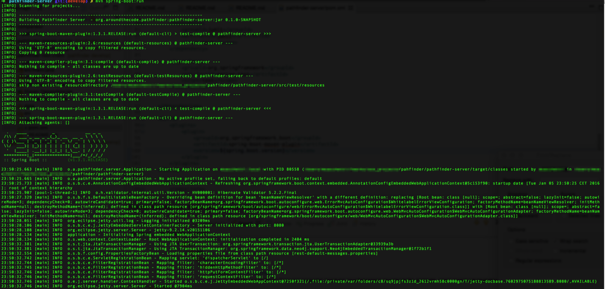

# Pathfinder-server

## Architecture

Pathfinder server is a wrapper for a Neo4j Server bundled as a Spring boot application.

## Getting started

To start the server you just have to checkout the project, jump into the **pathfinder-server** folder and run

```
mvn clean package spring-boot:run
```




Server with default settings will bind to localhost:8686 for Neo4j web administrator interface and localhost:8080 for rest api, so be sure to have such port free on your installation machine.

Both rest api and neo4j server binding can be customized via maven properties in main parent-pom or via command line.

E.g. if you whish to run Neo4J browser on port 8383 and API on 8282 you can run:

```
mvn clean package spring-boot:run -Dserver.port=8282 -Dneo4j.db.port=8383
```


Once the server is Up and running you can access Neo4J standard interface at <http://localhost:8686/browser/> to change default server credentials (**neo4j**/**neo4j**).

Default setup expect neo4j user/password to be changed with **neo4j**/**password**, you can customize such credential via maven properties in main parent-pom or via command line

```
mvn clean package spring-boot:run -Dneo4j.user=<new_username> -Dneo4j.pass=<new_password>
```

To start collecting data you can use [Pathfinder Maven Plugin](../pathfinder-maven-plugin).

If you customized the API port, remember to change maven plugin configuration accordingly.

Once you collect some data you can use [Web Interface](../pathfinder-web)  to start using Pathfinder 


[//]: # (These are reference links used in the body of this note and get stripped out when the markdown processor does its job. There is no need to format nicely because it shouldn't be seen. Thanks SO - http://stackoverflow.com/questions/4823468/store-comments-in-markdown-syntax)


   [Maven Dependency Plugin]: <https://maven.apache.org/plugins/maven-dependency-plugin/>
   [Michele Sacchetti]: <http://aroundthecode.org>
   [pathfinder-server]: <./pathfinder-server>
   [pathfinder-maven-plugin]: <./pathfinder-maven-plugin>
   [pathfinder-web]: <./pathfinder-web>


