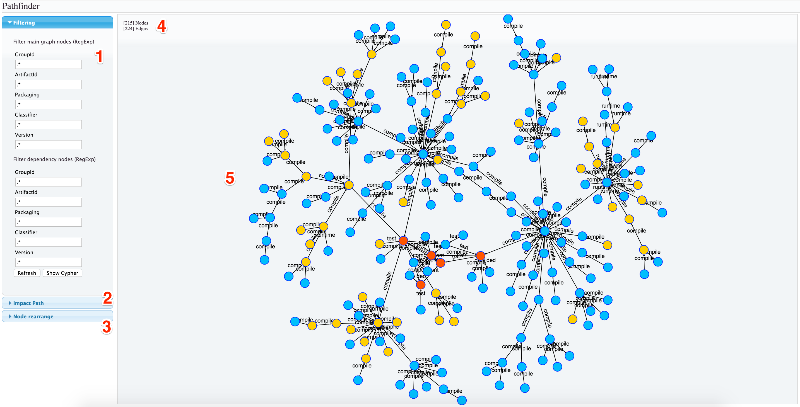

# Pathfinder Web Interface

This is a static HTML/JS project which provides Pathfinder user interface.

Is is based on [SigmaJS](http://sigmajs.org/) and [Linkurous](https://github.com/Linkurious/linkurious.js) javascript frameworks to render the graph, and [JQuery UI](https://jqueryui.com/) to create the User interface.

#Getting Started

Since it's a 100% static project, communicating with backend via Ajac calls you can deploy it on your favorite web server (e.g. Apache HTTP), deploy it into pathfinder-server static web folder, or even start it from your filesystem path.

## Web Server setup

Simply copy all submodule content into your main **docroot/** and open http://<your virtualhost>/pathfinder.html

## Pathfinder-Server setup

Copy all submodule content into pathfinder-server submodule public content (e.g. **pahfinder/pathfinder-server/src/main/resources/public/** ), start pathfinder-server as usual and point your browser at <http://localhost:8080/pathfinder.html>

## Local folder setup

Simply open pathfinder.html with your favorite browser.

#UI At a glance

This is a very quick description of different UI sections, refer to [User Guide](../docs) for more detail on how to use them.

1) **Filtering**: this section will allow you to filter grahp content to match you desired view
 
2) **Impact Path**: use this section to search for all nodes impacted by changes on a single artifact

3) **Node Rearrange**: Nodes usually auto-arrange themselves upon rendering, but if you want to try to re-arrange them without re-run the search again, you can use this section.

4) **Legenda**: it simply displays how many Nodes and Edges are present in current graph

5) **Graph area**: Make a guess? ;)
